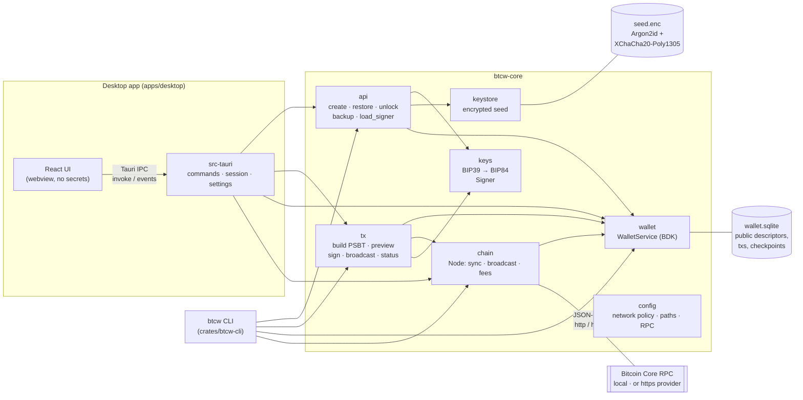
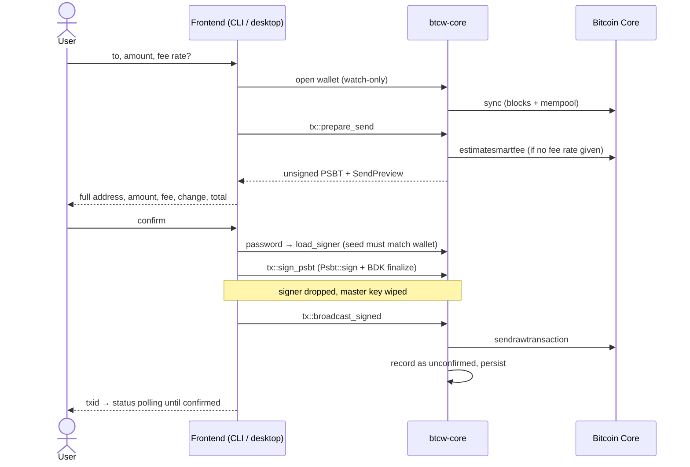

# Architecture

btcw is one Rust wallet engine (`btcw-core`) with two thin frontends: a terminal app (`btcw-cli`)
and a desktop app (Tauri + React). Neither frontend contains wallet logic; both call the same core
functions, so they behave the same and share the same wallet files.

## Components

| Module | Responsibility | Key crates |
|---|---|---|
| `config` | Network policy (testnet4 default, mainnet locked), per-network paths, RPC settings from flags › env › `btcw.toml` | `toml`, `dirs` |
| `keys` | BIP39 mnemonic → BIP32 master → BIP84 account; public descriptors with key origin; `Signer` (master key, wiped on drop) | `bip39`, `bitcoin`, `miniscript` |
| `keystore` | Mnemonic encrypted at rest; network bound as AEAD associated data; atomic 0600 writes | `argon2`, `chacha20poly1305` |
| `wallet` | `WalletService`: BDK wallet in SQLite, per-network file lock, birthday + backup flag, views (balance, history, UTXOs, addresses) | `bdk_wallet` (rusqlite) |
| `chain` | `Node`: connect + chain check, block-by-block sync with reorg handling, mempool (+ cache), broadcast, fee estimates, regtest mining | `bdk_bitcoind_rpc`, `bitcoincore-rpc`, `minreq` (TLS) |
| `book` | Address book (contacts) and transaction labels, in the wallet's SQLite file | `bdk_wallet` (rusqlite) |
| `tx` | Address parsing, PSBT build, preview (every output explained), sign + finalize, extract, broadcast, record, status, fee bumps (BIP125 RBF) | `bdk_wallet`, `bitcoin` |
| `api` | Lifecycle both frontends use: create / restore / unlock / watch-only / backup verify / reveal / load signer | — |

## Sending a payment

On any failure before the broadcast, the change address BDK reserved is released (`tx::cancel`),
so a declined or failed send leaves no trace.

## What is stored where

| File (`<datadir>/<network>/`) | Contents | Secret? |
|---|---|---|
| `wallet.sqlite` | BDK state: **public** descriptors, transactions, chain checkpoints; `btcw_meta` (birthday, backup flag); contacts and labels | No (reveals balances and addresses) |
| `seed.enc` | Recovery phrase, encrypted (Argon2id 64 MiB → XChaCha20-Poly1305) | Encrypted |
| `wallet.lock` | Held while a process has the wallet open | No |
| `mempool-cache.txt` | Mempool transactions already downloaded (public data) | No |
| `../desktop.json` | Desktop settings (network, node URL, auto-lock) | No, but a provider URL may hold an API key; mode 0600 |

The private key exists in memory only while signing (CLI) or while the desktop app is unlocked,
and is wiped on lock, on auto-lock, on network switch and on exit.

## Trust boundaries

- **Webview ↔ Rust (desktop):** the React UI never receives a private key, a PSBT or the phrase,
  except at creation and when the user asks to see it (with the password). A payment waiting for
  confirmation stays in Rust behind a random id. Strict CSP, no plugins, navigation and new windows
  blocked, two event permissions only.
- **Wallet ↔ node:** the node is trusted for chain data but never sees keys. The wallet checks the
  node is on the expected chain on every connect. A hosted node over `https` sees which blocks and
  mempool transactions are fetched (whole blocks, not addresses).
- **Disk:** only the seed is secret, and it is encrypted. Wallet files are per network, so a
  testnet wallet can't be opened as mainnet.
