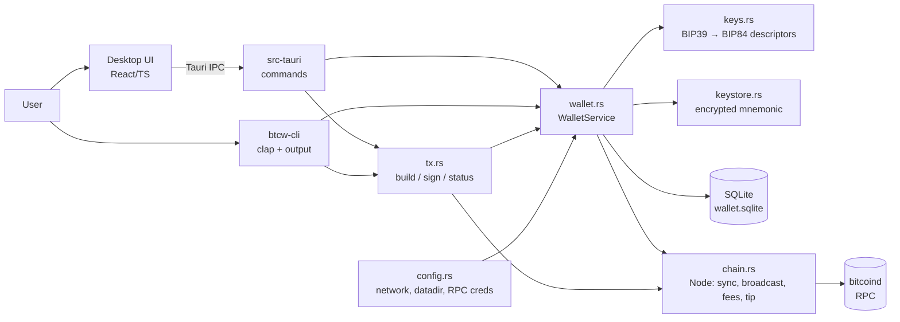

# Bitcoin Wallet: Plan, Algorithms and Pseudocode

Capstone: Rust for Bitcoin Cohort, Project 1 (Bitcoin Wallet).
Status: **draft, awaiting approval**. No code is written until this is approved.

---

## 1. What we must deliver (from the PRD)

| ID  | Requirement                                                        | Where it lives        |
|-----|--------------------------------------------------------------------|-----------------------|
| R1  | Create a new wallet                                                | `keys`, `wallet`      |
| R2  | Restore a wallet from an existing mnemonic                         | `keys`, `wallet`      |
| R3  | Hierarchical derivation, BIP84 native SegWit `m/84'/1'/0'/0/*`     | `keys`                |
| R4  | Generate new receive addresses and track which have been used      | `wallet`              |
| R5  | Sync with the chain to discover incoming transactions              | `chain`               |
| R6  | Show confirmed and unconfirmed balance                             | `wallet`              |
| R7  | List transaction history                                           | `wallet`              |
| R8  | Sign transactions via PSBT                                         | `tx`                  |
| R9  | Broadcast transactions                                             | `chain`               |
| R10 | Poll and display tx status (unconfirmed/confirmed, confirmations)  | `tx` + `chain`        |
| R11 | Persist wallet state between runs                                  | `wallet` (SQLite)     |
| D1  | GitHub repo                                                        | —                     |
| D2  | README                                                             | `README.md`           |
| D3  | Architecture diagram                                               | `docs/ARCHITECTURE.md`|
| D4  | Demo video / D5 live presentation                                  | you (we script it)    |

Suggested crates: `bitcoin`, `bdk_wallet`, BDK SQLite persistence, `bitcoincore-rpc`/`corepc-client`,
plus the general ones: `thiserror`, `anyhow`, `serde`, `clap`, `tracing`, `zeroize`, `comfy-table`, `indicatif`.

---

## 2. Key decisions (proposed; confirm or change)

| Decision            | Choice                                                             | Why |
|---------------------|--------------------------------------------------------------------|-----|
| App shape           | **Two frontends over one core library**: a Tauri desktop app (React UI) for users, and a CLI `btcw` (`clap` derive) for the terminal | Users get a real app, you keep the terminal, and every wallet feature is written once in `btcw-core`. |
| Wallet engine       | **`bdk_wallet` 3.x**                                               | The PRD recommends it. It handles descriptors, UTXO tracking, coin selection and PSBT building, so we don't write that consensus-critical code by hand. |
| Chain backend       | **Bitcoin Core RPC**: `bdk_bitcoind_rpc` (sync) + RPC client (broadcast, fees, mining) | You already have `bitcoind` v31. It's fully local, with no third-party servers, which suits a non-custodial wallet. |
| Persistence         | **SQLite** through `bdk_wallet`'s `rusqlite` feature               | One file, crash-safe, and easy to inspect. |
| Networks            | `testnet4` (default for real use), `signet`, `regtest` (dev/tests); **mainnet built in but locked** (see §4.1) | Network is one config value, never hardcoded, so mainnet can be unlocked later without a rewrite. |
| Seed storage        | **Encrypted keystore file**: Argon2id → XChaCha20-Poly1305, `zeroize` on drop | BDK persists only *public* descriptors, so the mnemonic has to live somewhere, and it should never be stored as plaintext. |
| Crate layout        | Cargo workspace: `crates/btcw-core` (lib), `crates/btcw-cli` (bin), `apps/desktop` (Tauri 2 + React/Vite/TS) | Both frontends stay thin. Tests hit the core directly. |
| Errors              | `thiserror` in the core, `anyhow` in the CLI, serializable error DTOs for the desktop app | Follows the PRD's recommendation. The UI gets clean, typed error messages. |
| Exact crate versions| Pinned during scaffolding so `bitcoin`, `bdk_wallet` and `bdk_bitcoind_rpc` share one `bitcoin` version | Mismatched `bitcoin` versions are the #1 build pain in this ecosystem. We always use `bdk_wallet::bitcoin` re-exports. |

---

## 3. The Bitcoin concepts behind it (short primer)

```
entropy (128 bits) ──BIP39──▶ 12-word mnemonic
mnemonic + optional passphrase ──PBKDF2-HMAC-SHA512, 2048 rounds──▶ 64-byte seed
seed ──HMAC-SHA512("Bitcoin seed")──▶ master xprv (BIP32)
master ──derive m/84'/1'/0'──▶ account xprv        (84' = BIP84 purpose, 1' = testnet coin type, 0' = account)
account ──/0/i──▶ receive keys      ──P2WPKH──▶ bcrt1q… / tb1q… addresses
account ──/1/i──▶ change keys       ──P2WPKH──▶ change addresses
```

- **Descriptor**: a string that fully describes which scripts a wallet owns, e.g.
  `wpkh(tprv…/84'/1'/0'/0/*)`. BDK is descriptor-based, so we produce two descriptors
  (external = receive, internal = change) and BDK derives everything else.
- **UTXO**: an unspent output we can spend. Balance = sum of our UTXOs.
- **Confirmed vs unconfirmed**: an unconfirmed tx sits in the mempool. A confirmed tx is in a block.
  `confirmations = tip_height − block_height + 1`.
- **Coinbase maturity**: mined coins can only be spent after 100 blocks. That's why regtest demos mine 101 blocks.
- **PSBT (BIP174)**: a "partially signed bitcoin transaction", i.e. an unsigned tx plus the metadata a signer needs
  (input amounts, derivation paths). Flow: *create → sign → finalize → extract → broadcast*.
- **Fee** = inputs − outputs. **Fee rate** = fee ÷ vsize (sat/vB). A 1-input, 2-output P2WPKH tx is ~141 vB.
- **Gap limit / lookahead**: when restoring, the wallet scans ahead a fixed number of unused addresses
  so it finds funds sent to addresses it hasn't handed out yet.

---

## 4. Architecture

```
bitcoinwallet/
├── Cargo.toml                 workspace
├── crates/
│   ├── btcw-core/             ALL wallet logic: keys, keystore, chain, wallet, tx, config, error
│   └── btcw-cli/              `btcw` terminal app (clap), thin layer over btcw-core
├── apps/desktop/
│   ├── src-tauri/             Tauri 2 Rust side: #[tauri::command]s that call btcw-core
│   └── src/                   React + TypeScript + Vite UI
├── scripts/regtest.sh         start/stop/fund/mine a local regtest node
└── docs/ (PLAN, ARCHITECTURE), WALKTHROUGH.md, README.md
```



### 4.1 Network policy (testnet now, mainnet later)

- `Network` is a single config value (`--network` flag / settings screen / `btcw.toml`). All network-specific
  behaviour comes from it: address HRP (`bc`/`tb`/`bcrt`), BIP84 coin type (`0'` mainnet, `1'` all test networks),
  default RPC port, and the data directory (`<datadir>/<network>/`), so wallets from different networks never mix.
- The wallet refuses to open a keystore or database created for another network, and refuses a node on the wrong chain
  (`getblockchaininfo.chain` is checked on connect).
- **Mainnet is locked by two gates.** (1) It's compiled out unless built with `--features mainnet`. (2) Even then, it has to be
  enabled explicitly in settings, with a typed confirmation. Until then, choosing `bitcoin` returns `MainnetDisabled`.
- Unlock checklist for later: security review of keystore and signing, fee-sanity caps (warn above N sat/vB or when the fee is more than X% of the amount),
  a send confirmation that shows the full address, and a real backup/restore test on signet first.

### 4.2 Desktop app (Tauri 2)

- **Rust owns all secrets.** The React side never receives the mnemonic after creation, a private key, or a descriptor
  with an xprv. It sends the password to a Rust command, and Rust unlocks the wallet and keeps it in app state
  (`Mutex<Option<WalletService>>`). "Lock" drops it (zeroize).
- **Backup reminder (owner's request):** banner on the dashboard and the send screen while
  `AppInfo.backup_verified` is false; "Verify backup" (password + 3 random words) and "Show
  recovery phrase" (password, any time) in Settings. Commands: `verify_backup(password, answers)`,
  `backup_challenge() -> positions`, `reveal_phrase(password) -> words` (the only command besides
  `create_wallet` that returns the words).
- Commands (async, run on a blocking thread so the UI stays responsive):
  `create_wallet(words, password) -> MnemonicOnce` · `restore_wallet(phrase, password)` · `unlock(password)` · `lock()` ·
  `new_address()` · `list_addresses()` · `sync()` (emits `sync-progress` events) · `balance()` · `history()` · `utxos()` ·
  `prepare_send(to, sats, fee_rate) -> SendPreview` · `confirm_send(preview_id) -> Txid` · `tx_status(txid)` · `get_settings()/set_settings()`.
- Screens: Welcome (create / restore) → Backup phrase (shown once, then the user confirms 3 of the words) → Unlock →
  Dashboard (balances, recent txs, sync button) → Receive (address + QR + used/unused list) → Send (form → preview with fee → confirm)
  → Tx detail (live status and confirmations, polled every 10 s) → Settings (network, node RPC, auto-lock).
- A persistent network badge (e.g. orange "TESTNET4") shows on every screen so testnet coins are never mistaken for real ones.
- Tauri's capabilities/CSP are locked down: no remote URLs, no shell or fs plugins exposed to JS.
- **CLI and desktop share the same datadir and wallet files.** A lock file prevents both from writing the same wallet at once.

### Module contracts (fixed in Phase 0 so agents can work in parallel)

**The authoritative contract is the stub code in `crates/btcw-core/src/*.rs`**: every function
signature plus its doc comment, with `todo!("Agent X")` bodies. Summary:

| Module | Owner | Key items |
|---|---|---|
| `config` | Phase 0 ✅ | `Config::load(Overrides)`: flags > `BTCW_*` env > `btcw.toml` > defaults; `check_network_allowed`, `coin_type`, per-network paths |
| `error` | Phase 0 ✅ | `WalletError` + stable `code()` strings for `--json` and the UI |
| `types` | Phase 0 ✅ | Serializable views: `AddressRow`, `BalanceView`, `TxRow`, `TxStatus`, `UtxoRow`, `SyncProgress/Report`, `SendPreview` |
| `api` | Phase 0 ✅ | `create_wallet`, `restore_wallet`, `unlock_wallet` → `Unlocked { wallet, signer }`, `open_watch_only` |
| `testnode` | Phase 0 ✅ | Throwaway regtest `bitcoind` with a funded "faucet" wallet (feature `test-utils`) |
| `keys` | Agent A | `generate_mnemonic`, `parse_mnemonic`, `derive_account → (Descriptors /*public*/, Signer)`, `Signer::sign_psbt` |
| `keystore` | Agent A | `save` / `load` (Argon2id + XChaCha20-Poly1305, network bound as AAD) |
| `chain` | Agent B | `Node::connect / tip_height / sync / broadcast / estimate_fee_rate / mine` |
| `wallet` | Agent C | `WalletService::create(cfg, &Descriptors, birthday) / open(cfg, Option<&Descriptors>)`, `new_address / addresses / balance / history / utxos / persist` |
| `tx` | Agent F | `parse_address / build_psbt / preview / cancel / sign_psbt(wallet, signer, psbt) / extract_tx / record_broadcast / tx_status` |

**Phase 0 findings that changed the design:**
1. **BDK 3.2 deprecated `Wallet::sign`.** The wallet now holds only *public* descriptors, and a separate
   `keys::Signer` (the master xprv, in memory only while unlocked) signs with rust-bitcoin's `Psbt::sign`.
   BDK then finalizes with `finalize_psbt`. Proven on regtest in `tests/phase0_smoke.rs`.
   Side benefit: **watch-only mode**, so balance, history and addresses can be viewed without a password.
2. **Wallet birthday.** A new wallet records the tip height at creation and sync starts there, so it never
   scans the whole testnet4 chain. Restores scan from genesis unless the user gives a birthday.
3. **RPC timeouts.** `bitcoincore-rpc`'s HTTP client times out after 15 s, and Core v31 mines regtest blocks at about
   200 ms each. Test mining is batched, and `chain::Node` must use a 120 s transport timeout.
4. Everything else checked out against Core v31: `bdk_bitcoind_rpc` sync, typed `getblockchaininfo`,
   `estimatesmartfee`, `sendrawtransaction`.


### CLI surface

```
btcw [--network testnet4|signet|regtest] [--datadir PATH] [--json] <command>   # default: testnet4

  create [--words 12|24]               new wallet, show mnemonic ONCE, encrypt it
  restore                              prompt for mnemonic (hidden), rebuild + full sync
  address new                          next unused receive address
  address list                         all revealed addresses with used/unused
  sync                                 pull new blocks + mempool, persist
  balance                              confirmed / unconfirmed / immature / total
  history                              tx list with net amount, fee, status, confirmations
  utxos                                spendable outputs
  send --to ADDR --amount SATS [--fee-rate N] [--yes] [--psbt-out FILE]
  status TXID [--watch] [--interval SECS] [--until N]
  mine N [--to ADDR]                   regtest only, for demos
```
Every CLI command maps 1:1 to a desktop command in §4.2, and both call the same `btcw-core` functions.

---

## 5. Algorithms and pseudocode

### 5.1 Create wallet (R1, R3, R11)
```
fn create(cfg, words):
    if exists(cfg.keystore_path) or exists(cfg.wallet_db_path): fail WalletExists
    mnemonic   = generate_mnemonic(words)                 // OS CSPRNG entropy
    print mnemonic ONCE with a "write this down" warning  // never logged, never in --json unless --show-secret
    password   = prompt_twice_hidden()
    keystore::save(cfg.keystore_path, mnemonic, password) // file mode 0600
    (descriptors, signer) = derive_account(mnemonic, "", cfg.network, account=0)   // public descs + signer
    birthday   = node.tip_height() if reachable else None
    wallet     = bdk::Wallet::create(descriptors.external, descriptors.internal)
                    .network(cfg.network).create_wallet(sqlite); store birthday
    wallet.persist()
    zeroize(mnemonic, password); signer dropped when the command ends
```

### 5.2 Restore wallet (R2)
```
fn restore(cfg):
    phrase   = prompt_hidden("mnemonic")
    mnemonic = parse_mnemonic(phrase)          // checks wordlist + checksum → InvalidMnemonic
    password = prompt_twice_hidden()
    keystore::save(...); create wallet exactly as in 5.1
    node.sync(wallet, from_height = 0)         // full rescan; lookahead finds already-used addresses
    print balance
```

### 5.3 Open existing wallet (every other command)
```
fn open_watch_only(cfg):                                  // balance, history, addresses, sync
    wallet = bdk::Wallet::load()                          // public descriptors come from the DB
                .check_network(cfg.network)               // refuse a wallet from another network
                .load_wallet(sqlite)? or fail WalletNotFound

fn unlock(cfg, password):                                 // needed only to send
    mnemonic = keystore::load(cfg.keystore_path, cfg.network, password)   // AEAD tag fails → WrongPassword
    (descriptors, signer) = derive_account(mnemonic, "", cfg.network, 0)
    wallet = bdk::Wallet::load().descriptor(External, Some(descriptors.external))  // seed must match DB
                                .descriptor(Internal, Some(descriptors.internal))
                                .check_network(cfg.network).load_wallet(sqlite)
    return Unlocked { wallet, signer }                    // signer = master xprv, memory only
```

### 5.4 Receive address + used tracking (R4)
```
fn new_address():
    info = wallet.next_unused_address(External)   // reuses an address that was revealed but never received funds
    wallet.persist()                              // revealed index must survive restarts
    return (info.index, info.address)

fn addresses():
    for (index, spk) in wallet.spk_index().revealed_spks(External):
        used = wallet.spk_index().is_used(External, index)   // has any tx output paid to it
        yield (index, Address::from_script(spk, network), used)
```

### 5.5 Sync (R5)
```
fn sync(node, wallet):
    start   = wallet.latest_checkpoint()                  // resume point (persisted)
    emitter = bdk_bitcoind_rpc::Emitter::new(rpc, start, wallet.birthday_height(), wallet_unconfirmed_txs)
    progress_bar = indicatif
    while let Some(block_event) = emitter.next_block():
        wallet.apply_block_connected_to(block, height, connected_to)   // handles reorgs via checkpoints
        progress_bar.set(height)
        if height % 100 == 0: wallet.persist()             // crash-safe progress
    mempool = emitter.mempool()
    wallet.apply_unconfirmed_txs(mempool.txs)              // unconfirmed incoming/outgoing
    wallet.apply_evicted_txs(mempool.evicted)              // dropped from mempool
    wallet.persist()
    return SyncReport { new_tip, blocks_scanned, new_txs }
```
*The exact method names get verified against the pinned bdk 3.x docs during scaffolding. The algorithm itself stays the same.*

### 5.6 Balance (R6)
```
fn balance():
    b = wallet.balance()               // BDK: confirmed, trusted_pending, untrusted_pending, immature
    confirmed   = b.confirmed
    unconfirmed = b.trusted_pending + b.untrusted_pending   // trusted = our own change
    immature    = b.immature           // coinbase < 100 confs (shows up on regtest)
    total       = confirmed + unconfirmed + immature
```

### 5.7 History (R7)
```
fn history(tip):
    rows = []
    for tx in wallet.transactions():
        (sent, received) = wallet.sent_and_received(tx)
        net  = received − sent
        fee  = wallet.calculate_fee(tx).ok()             // unknown for txs we didn't fund
        status = match tx.chain_position:
            Confirmed{anchor} → Confirmed(height, confs = tip − height + 1, time = anchor.block_time)
            Unconfirmed{seen} → Unconfirmed(first_seen = seen)
        rows.push(...)
    sort rows: unconfirmed first, then by height desc
```

### 5.8 Send: build → sign → broadcast (R8, R9)
```
fn send(to_str, amount_sat, fee_rate_opt, yes):
    addr = to_str.parse::<Address<NetworkUnchecked>>()?.require_network(cfg.network)?   // NetworkMismatch
    amount = Amount::from_sat(amount_sat); ensure amount >= dust (294 sat for P2WPKH)
    node.sync(wallet)                                   // spend from fresh UTXO state
    rate = fee_rate_opt or node.estimate_fee_rate(6) or fallback 2 sat/vB (regtest has no estimates)

    // 1. BUILD (unsigned PSBT). BDK does coin selection + change output + RBF signalling
    psbt = wallet.build_tx().add_recipient(addr.script_pubkey(), amount).fee_rate(rate).finish()
           → InsufficientFunds{needed, available} on failure

    // 2. SHOW + CONFIRM
    fee = psbt.fee(); print to, amount, fee, fee rate, total, change
    if --psbt-out: write base64 PSBT (lets you inspect it with `bitcoin-cli decodepsbt`)
    if not yes and not confirm(): abort (unused change index is fine, just unrevealed)

    // 3. SIGN + FINALIZE  (BDK 3.2: rust-bitcoin signs, BDK finalizes)
    signer.sign_psbt(&mut psbt)          // Psbt::sign(master_xprv): finds keys via bip32_derivation
    finalized = wallet.finalize_psbt(&mut psbt, SignOptions::default())   // builds the witnesses
    ensure finalized else SignError

    // 4. EXTRACT + BROADCAST
    tx   = psbt.extract_tx()                            // also sanity-checks absurd fee rates
    txid = node.broadcast(tx)                           // sendrawtransaction
    wallet.apply_unconfirmed_txs([(tx, now)])           // balance reflects the spend immediately
    wallet.persist()
    print txid + "run `btcw status <txid> --watch`"
```

### 5.8b Backup check and showing the phrase (added on the owner's request)
```
create          → backup_verified = false (missing row = false)
restore         → backup_verified = true
every command   → if !read_backup_verified(cfg): warn "run `btcw backup verify`"   // lock-free read
backup verify   → password; positions = 3 random (OS RNG); hidden prompts
                  verify_backup: decrypt, compare (case-insensitive) → mark verified | BackupMismatch(positions)
backup show     → password → numbered grid, any time; never --json
send            → watch-only open → sync → build → preview → confirm → *then* password → load_signer
```

### 5.9 Status polling (R10)
```
fn status(txid, watch, interval, until_confs):
    loop:
        node.sync(wallet)
        tip = node.tip_height()
        match wallet.get_tx(txid):
            None               → print "not found in wallet" ; return
            Some(Unconfirmed)  → print "unconfirmed (in mempool)"
            Some(Confirmed{h}) → print "confirmed in block h, (tip − h + 1) confirmations"
        if not watch or confs >= until_confs: return
        sleep(interval)        // Ctrl-C exits cleanly
```

### 5.10 Keystore encryption
```
save(path, mnemonic, password):
    salt  = random 16 bytes ; nonce = random 24 bytes
    key   = Argon2id(password, salt, m=64MiB, t=3, p=1) → 32 bytes
    ct    = XChaCha20Poly1305(key).encrypt(nonce, mnemonic.to_string(), aad = "btcw-v1|" + network)
    write JSON {version:1, network, kdf params, salt, nonce, ct} with mode 0600 (atomic: tmp + rename)
    zeroize(key)
load(path, password):
    parse JSON; re-derive key; decrypt → WrongPassword if tag fails; parse_mnemonic
```

---

## 6. How the work is split across agents

Each agent runs in its **own git worktree** with a written brief: its module contract from §4, acceptance
criteria and required tests. Agents may only edit their own files. I review every result before merging (§8).

```
Phase 0  Scaffold (me, sequential)
         git init · workspace Cargo.toml with pinned compatible versions · btcw-core stubs with the §4 signatures
         error.rs · config.rs (network policy §4.1) · Tauri 2 + Vite/React skeleton · shared TS types for commands
         scripts/regtest.sh (start/stop/fund/mine) · CI (fmt, clippy, test, frontend lint/typecheck)
            │
Phase 1  ┌────────────┬────────────────┬─────────────────┬────────────────┬──────────────────────┐ (parallel)
         │ Agent A    │ Agent B        │ Agent C         │ Agent D        │ Agent E              │
         │ core/keys  │ core/chain     │ core/wallet     │ btcw-cli       │ desktop UI (React)   │
         │ keystore   │ sync,broadcast,│ create/open,    │ clap commands, │ all screens in §4.2  │
         │ BIP84 vecs │ fees,tip,mine  │ addresses, bal, │ tables,--json, │ against a MOCK       │
         │ encryption │ regtest tests  │ history, utxos  │ prompts        │ command layer        │
         └────────────┴────────────────┴─────────────────┴────────────────┴──────────────────────┘
            │  review + merge (me)
Phase 2  ┌──────────────────────────┬──────────────────────────────┬─────────────────────────────┐ (parallel)
         │ Agent F                  │ Agent G                      │ Agent H                     │
         │ core/tx: build/sign/     │ src-tauri: real commands →   │ e2e tests on regtest:       │
         │ extract, send + status   │ btcw-core, app state, lock,  │ create→fund→sync→send→      │
         │ (CLI send/status too)    │ sync-progress events; swap   │ confirm→restart→restore     │
         │                          │ mock layer for real IPC      │ (core API + CLI binary)     │
         └──────────────────────────┴──────────────────────────────┴─────────────────────────────┘
            │  review + merge (me)
Phase 3  Docs + polish (Agent I, then me): README, docs/ARCHITECTURE.md, demo script (testnet4 + regtest),
         app packaging (.deb / AppImage), WALKTHROUGH.md polish
```

Why this split works: the contracts are fixed in Phase 0, so Agent C can test with a known test descriptor
without waiting for A, Agent D builds the CLI against the `WalletService` signatures, and Agent E builds the whole UI
against a mock of the Tauri command contract (same TypeScript types). Phase 2 needs real keys, wallet and chain code,
so it runs after Phase 1 merges.

---

## 7. Testing strategy

| Level        | What                                                                                       |
|--------------|--------------------------------------------------------------------------------------------|
| Unit         | **BIP84 official test vector**: mnemonic `abandon ×11 about`, mainnet `m/84'/0'/0'/0/0` must be `bc1qcr8te4kr609gcawutmrza0j4xv80jy8z306fyu`. This checks derivation only and doesn't need the mainnet feature. Invalid mnemonic/checksum is rejected. Keystore round-trips, wrong password fails, tampered file fails. Choosing mainnet without the feature gives `MainnetDisabled`. |
| Integration  | A real `bitcoind -regtest` spawned per test run (`corepc-node` with `BITCOIND_EXE=~/.local/bin/bitcoind`). Fund the wallet from a Core "faucet" wallet, sync, check balances, send, mine, check confirmations. |
| Persistence  | Create → receive → drop the wallet → reopen → same balance, same revealed index, no re-sync needed. A wallet created in the CLI opens in the desktop app. |
| Restore      | Restore from the same mnemonic in a fresh datadir → full sync finds the same UTXOs.        |
| Negative     | Wrong-network address, insufficient funds, dust amount, wallet already exists, wrong password, node on the wrong chain. |
| Frontend     | Vitest + Testing Library for screens (send form validation, backup-phrase confirmation, error display). Rust unit tests for the Tauri command layer. |
| Manual       | A testnet4 run against a synced testnet4 node: faucet → receive → send → watch confirmations. |
| Gates        | `cargo fmt --check`, `cargo clippy --all-targets -- -D warnings`, `cargo test`, `npm run lint && npm run typecheck && npm test`, all green before any merge. |

---

## 8. My review checklist (applied to every agent's output)

1. **Correct against Bitcoin rules**: right derivation path and coin type per network, right address HRP,
   change goes to the internal keychain, and the fee rate is sane.
2. **Secrets**: the mnemonic and xprv never show up in logs, errors, `Debug` output, `--json`, or anything sent to the React side after the one-time backup screen. They're zeroized, and the keystore has 0600 perms.
3. **Network safety**: nothing hardcodes a network, mainnet stays behind both gates, and the UI always shows the network badge.
4. **Meets the contract**: signatures match §4 and no files outside the agent's scope were touched.
5. **Error handling**: no `unwrap()` or `expect()` on user or network input, and errors carry useful context.
6. **Tests**: they cover the acceptance criteria, including failure paths, and actually run against regtest.
7. **Rust quality**: idiomatic ownership, no needless clones, clippy clean. For TypeScript: strict mode, no `any`.
8. **Walkthrough**: the agent adds a section to `WALKTHROUGH.md` explaining what it built and why.

---

## 9. Prerequisites and open questions

**Install once before the desktop app is built** (Tauri on Linux, needs sudo; the Tauri CLI comes from npm):
```
sudo apt install libwebkit2gtk-4.1-dev build-essential curl wget file libxdo-dev libssl-dev libayatana-appindicator3-dev librsvg2-dev
```
Also needed: a **testnet4 node** for real testing (`bitcoind -testnet4 -prune=2000` is fine; the first sync takes a while).
Regtest needs nothing extra.

Open questions:
1. Should the repo live under your own GitHub account (`luhrhenz`)? Is it a solo or team submission?
2. Do you have a **submission deadline**? That decides whether we attempt the stretch goals
   (terminal UI, QR scanning, `--psbt-in` signing of external PSBTs).
